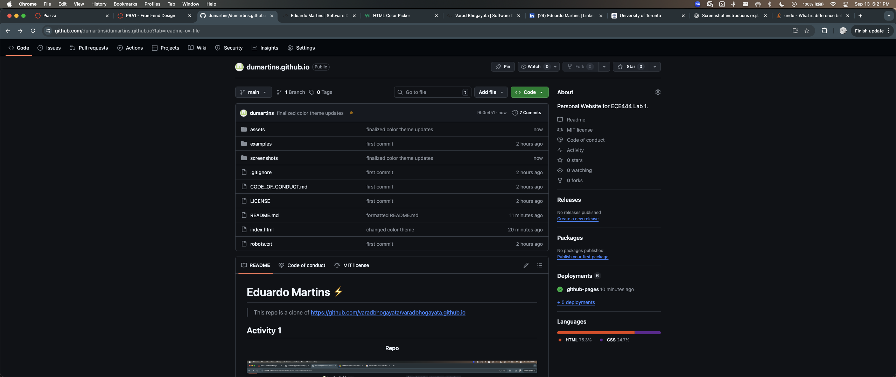
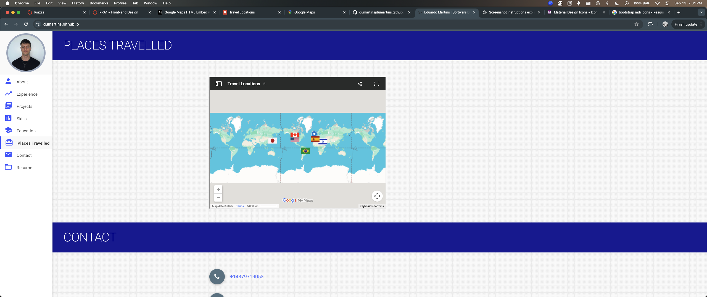

# Eduardo Martins ⚡️ 
> This repo is a clone of https://github.com/varadbhogayata/varadbhogayata.github.io 

## Activity 1

 
    <strong> Repo</strong>   
    

## Activity 2

 
    <strong> Repo</strong>   
      
    <strong> Home Page</strong>   
    

## Activity 3

 
    <strong> Repo</strong>   
      
    <strong> Home Page</strong>   
    

## Activity 4

 
    <strong> Repo</strong>   
      
    <strong> Places Travelled Page</strong>   
    

## License 📄
This project is licensed under the MIT License - see the [LICENSE.md](./LICENSE) file for details.
### dumartins.github.io
